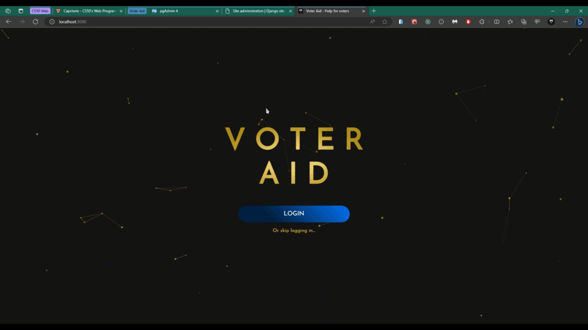

# Voter Aid

Hello world! I'd like to introduce you to my final project for [CS50 Web Programming with Python and JavaScript course](https://cs50.harvard.edu/web/2020/).
I call it **Voter Aid** and it's a mobile-responsive web application developed in Django (Python) and React (Javascript).

You can [click here](https://youtu.be/25ysHddm28Q/) to check it up:

## What exactly is Voter Aid?

It was mainly designed and implemented to help voters to get information about their candidates and political parties during election times. Showing their background info, campaign promises, political ideologies and also, compatibility towards them. In addition, you can like or rate them, so other users can be aware of their (un)popularity. And last but not least, can participate in polls for a candidate weekly and check current and past results.
As this project has only academical purposes, it's kinda small but has the potential to become more. Also, configuration is not set for production-like environment, but development.
Data is preloaded at web server startup, so features like candidates or political parties creation, or account management were not part of this scope.

## Justification

Finishing this project took me almost 3 years and not because of lack of experience, effort, attention or anything else. But a bunch of reasons such as creative blocks, increased workloads, changing jobs, etc. Don't get me wrong, I successfully delivered all previous projects in a time window of 2 months back in 2020, but the final project really got my head overthinking.

One year later, I found an idea that not only challenged myself, but also could help my fellow countrymen since there were elections during that time at my country. So, I looked for inspiration on what to do and found some by checking pages like Kickstarter.
All of that, plus new professional experiences, political unrest and the desire of helping my country resulted on this web app.

## Distinctiveness and Complexity

This application also took much time because of its complexity, as logically and technically. I did a research to know what minimum information is expected from a political candidate or party and extracted the info from over 60 candidates and their respective parties, from different sources. On top of that, a research about what technologies suited this project and on what I had interest in to learn, so it would've fun and challenging.

### Built with

Taking all of the above in mind, resulted into this:

* Docker was used to run this application in multiple containers:
  * Backend server
  * Frontend server
  * Database server
* Backend built from scratch using Django framework, including frameworks/libraries such as:
  * Django REST Framework
  * Gunicorn
  * Pillow
  * Whitenoise
* Frontend built from scratch using React framework, including frameworks/libraries such as:
  * Material UI
  * React Router
  * React Toolkit
  * Axios
  * ApexCharts
* PostgresSQL used for database purposes and pgAdmin, to check it out
* Data modelling resulted in a total of over 20 Django models related to each other
* Automatically populates database from a json file, and copies media files to file system at startup
* Includes charts to compare interests compatibility, also polls results
* Generated random data to populate mockup ratings and polls
* Saved passwords are hashed in database
* Mobile-responsive

### Project Structure

<pre>
└───📦 capstone/ - <b><i>main directory for project</i></b>
    ├───📁 backend/ - <b><i>directory for backend (django app)</i></b>
    │   ├───📁 files/ - <b><i>directory for database json (populate) and media files</i></b>
    │   ├───📁 finalproject/ - <b><i>directory for python package that contains utilities for django app</i></b>
    │   │   ├───📄 asgi.py - <b><i>file that contains django app asgi web server entrypoint</i></b>
    │   │   ├───📄 settings.py - <b><i>file for django app settings</i></b>
    │   │   ├───📄 urls.py - <b><i>file fthat containsor django app urls</i></b>
    │   │   ├───📄 wsgi.py - <b><i>file that contains django app wsgi web server entrypoint</i></b>
    │   │   └───📄 __init__.py - <b><i>init file to mark directory as package</i></b>
    │   ├───📁 voteraid/ - <b><i>directory for python package that contains all utilities and settings related to backend project app</i></b>
    │   │   ├───📁 migrations/ - <b><i>directory for database migrations</i></b>
    │   │   ├───📄 admin.py - <b><i>file that contains admin classes for management for models</i></b>
    │   │   ├───📄 apps.py - <b><i>file that overrides app config, to use new default auto field</i></b>
    │   │   ├───📄 managers.py - <b><i>file that overrides user manager, so email is used instead of username</i></b>
    │   │   ├───📄 mixins.py - <b><i>file that contains functionalities that can be reused between views</i></b>
    │   │   ├───📄 models.py - <b><i>file that contains all the models needed for the application</i></b>
    │   │   ├───📄 renderers.py - <b><i>file that overrides default renderer, to disable html form</i></b>
    │   │   ├───📄 serializers.py - <b><i>file that contains serializers used by DRF, so models complex types can be (de)serialized</i></b>
    │   │   ├───📄 urls.py - <b><i>file that contains all urls (routes) for the application</i></b>
    │   │   ├───📄 utils.py - <b><i>file that contains utilities, like a custom exception handler</i></b>
    │   │   ├───📄 views.py - <b><i>file that contains all views, including each HTTP method functions and its logic respectively</i></b>
    │   │   └───📄 __init__.py - <b><i>init file to mark directory as package</i></b>
    │   ├───📄 .gitignore - <b><i>gitignore file</i></b>
    │   ├───📄 docker-entrypoint.sh - <b><i>entrypoint file for docker building</i></b>
    │   ├───📄 Dockerfile - <b><i>dockerfile to build backend application</i></b>
    │   ├───📄 manage.py - <b><i>manage file that is used as a command-line utility to interact with django app</i></b>
    │   ├───📄 requirements.txt - <b><i>requirements file for python dependencies</i></b>
    │   └───📄 voteraid_stuff.7z - <b><i>file that contains database json and media files compressed</i></b>
    ├───📁 frontend/ - <b><i>directory for frontend (react app)</i></b>
    │   ├───📁 node_modules/ - <b><i>directory for node dependencies</i></b>
    │   ├───📁 public/ - <b><i>directory for served files like the html file where react app is loaded from</i></b>
    │   │   ├───📄 favicon.ico - <b><i>icon file for project</i></b>
    │   │   ├───📄 index.html - <b><i>html file that serves the react app</i></b>
    │   │   ├───📄 manifest.json - <b><i>manifest file with settings like icon's</i></b>
    │   │   └───📄 robots.txt - <b><i>robots file with instructions to not allow robots</i></b>
    │   ├───📁 src/ - <b><i>directory for frontend project app</i></b>
    │   │   ├───📁 api/ - <b><i>directory for api calling utilities</i></b>
    │   │   │   └───📄 index.js - <b><i>file that contains all api utilities such as config, session and handlers</i></b>
    │   │   ├───📁 components/ - <b><i>directory for react components</i></b>
    │   │   │   ├───📁 candidate/ - <b><i>directory for candidate components</i></b>
    │   │   │   │   ├───📄 BackCard.js - <b><i>file that contains BackCard component</i></b>
    │   │   │   │   ├───📄 CandidateCard.js - <b><i>file that contains CandidateCard component</i></b>
    │   │   │   │   ├───📄 CandidateInfo.js - <b><i>file that contains CandidateInfo component</i></b>
    │   │   │   │   ├───📄 CandidateList.js - <b><i>file that contains CandidateList component</i></b>
    │   │   │   │   ├───📄 CandidateSearchBar.js - <b><i>file that contains CandidateNameControl, ElectionTypeControl, PartyControl and CandidateSearchBar components</i></b>
    │   │   │   │   ├───📄 FrontCard.js - <b><i>file that contains FrontCard component</i></b>
    │   │   │   │   └───📄 index.js - <b><i>file that contains all candidate components, to be shared across the application</i></b>
    │   │   │   ├───📁 common/ - <b><i>directory for common (utilities) components</i></b>
    │   │   │   │   ├───📄 AlertNotification.js - <b><i>file that contains AlertNotification component</i></b>
    │   │   │   │   ├───📄 ColorPicker.js - <b><i>file that contains ColorPicker component</i></b>
    │   │   │   │   ├───📄 ContainerMain.js - <b><i>file that contains ContainerMain component</i></b>
    │   │   │   │   ├───📄 FavoriteCheckbox.js - <b><i>file that contains FavoriteCheckbox component</i></b>
    │   │   │   │   ├───📄 index.js - <b><i>file that contains all common (utilities) components, to be shared across the application</i></b>
    │   │   │   │   ├───📄 MainButtonMenu.js - <b><i>file that contains MainButtonMenu component</i></b>
    │   │   │   │   ├───📄 PeriodTitle.js - <b><i>file that contains PeriodTitle component</i></b>
    │   │   │   │   ├───📄 StarRating.js - <b><i>file that contains StarRating component</i></b>
    │   │   │   │   ├───📄 SubtitleShadow.js - <b><i>file that contains SubtitleShadow component</i></b>
    │   │   │   │   ├───📄 ThemedButton.js - <b><i>file that contains ThemedButton component</i></b>
    │   │   │   │   └───📄 Transition.js - <b><i>file that contains Transition component</i></b>
    │   │   │   ├───📁 login/ - <b><i>directory for login components</i></b>
    │   │   │   │   ├───📄 index.js - <b><i>file that contains all login components, to be shared across the application</i></b>
    │   │   │   │   └───📄 SignIn.js - <b><i>file that contains SignIn component</i></b>
    │   │   │   ├───📁 navbar/ - <b><i>directory for navbar components</i></b>
    │   │   │   │   ├───📄 AccountMenu.js - <b><i>file that contains AccountMenu component</i></b>
    │   │   │   │   ├───📄 DrawerMenu.js - <b><i>file that contains DrawerMenu component</i></b>
    │   │   │   │   ├───📄 index.js - <b><i>file that contains all navbar components, to be shared across the application</i></b>
    │   │   │   │   └───📄 NavBar.js - <b><i>file that contains NavBar component</i></b>
    │   │   │   ├───📁 party/ - <b><i>directory for party components</i></b>
    │   │   │   │   ├───📄 index.js - <b><i>file that contains all party components, to be shared across the application</i></b>
    │   │   │   │   ├───📄 PartyCard.js - <b><i>file that contains PartyCard component</i></b>
    │   │   │   │   ├───📄 PartyInfo.js - <b><i>file that contains PartyInfo component</i></b>
    │   │   │   │   ├───📄 PartyList.js - <b><i>file that contains PartyList component</i></b>
    │   │   │   │   └───📄 PartySearchBar.js - <b><i>file that contains PartyNameControl and PartySearchBar components</i></b>
    │   │   │   ├───📁 poll/ - <b><i>directory for poll components</i></b>
    │   │   │   │   ├───📄 index.js - <b><i>file that contains all poll components, to be shared across the application</i></b>
    │   │   │   │   ├───📄 PollList.js - <b><i>file that contains PollList component</i></b>
    │   │   │   │   ├───📄 PollResult.js - <b><i>file that contains PollResult component</i></b>
    │   │   │   │   └───📄 VotePoll.js - <b><i>file that contains VotePoll component</i></b>
    │   │   │   ├───📁 register/ - <b><i>directory for register components</i></b>
    │   │   │   │   ├───📄 CustomizedSlider.js - <b><i>file that contains CustomizedSlider component</i></b>
    │   │   │   │   ├───📄 index.js - <b><i>file that contains all register components, to be shared across the application</i></b>
    │   │   │   │   ├───📄 PersonalInfo.js - <b><i>file that contains PersonalInfo component</i></b>
    │   │   │   │   ├───📄 Review.js - <b><i>file that contains Review component</i></b>
    │   │   │   │   └───📄 VoterInfo.js - <b><i>file that contains VoterInfo component</i></b>
    │   │   │   └───📁 routing-helpers/ - <b><i>directory for routing-related components</i></b>
    │   │   │       ├───📄 index.js - <b><i>file that contains all routing helper components, to be shared across the application</i></b>
    │   │   │       └───📄 NoMatch.js - <b><i>file that contains NoMatch component</i></b>
    │   │   ├───📁 contexts/ - <b><i>directory for react contexts</i></b>
    │   │   │   └───📁 Device/ - <b><i>directory for device context</i></b>
    │   │   │       └───📄 index.js - <b><i>file that contains device context, that provides attributes like height and width to components, based on media queries</i></b>
    │   │   ├───📁 hooks/ - <b><i>directory for react hook utilities</i></b>
    │   │   │   ├───📄 index.js - <b><i>file that contains all custom hooks, to be shared across the application</i></b>
    │   │   │   ├───📄 useCurrentPeriod.js - <b><i>file that contains useCurrentPeriod, to get current period from api</i></b>
    │   │   │   ├───📄 useElectionTypes.js - <b><i>file that contains useElectionTypes, to get election types from api</i></b>
    │   │   │   ├───📄 useLimitedCandidates.js - <b><i>file that contains useLimitedCandidates, to get limited candidates from api</i></b>
    │   │   │   ├───📄 useLimitedParties.js - <b><i>file that contains useLimitedParties, to get limited parties from api</i></b>
    │   │   │   ├───📄 useNavigateSearch.js - <b><i>file that contains useNavigateSearch hook, which is an enhanced custom version of useNavigate from react router</i></b>
    │   │   │   └───📄 useScrollPercentage.js - <b><i>file that contains useScrollPercentage hook, to get scroll percentage in real-time</i></b>
    │   │   ├───📁 pages/ - <b><i>directory for application pages</i></b>
    │   │   │   ├───📄 AllCandidates.js - <b><i>file that contains AllCandidates page component</i></b>
    │   │   │   ├───📄 AllParties.js - <b><i>file that contains AllParties page component</i></b>
    │   │   │   ├───📄 AllPolls.js - <b><i>file that contains AllPolls page component</i></b>
    │   │   │   ├───📄 App.js - <b><i>file that contains App page component, including navbar and outlet for routing</i></b>
    │   │   │   ├───📄 Candidate.js - <b><i>file that contains Candidate page component</i></b>
    │   │   │   ├───📄 Home.js - <b><i>file that contains Home page component</i></b>
    │   │   │   ├───📄 index.js - <b><i>file that contains all page components, to be shared across the application</i></b>
    │   │   │   ├───📄 Login.js - <b><i>file that contains Login page component</i></b>
    │   │   │   ├───📄 Main.js - <b><i>file that contains Main page component</i></b>
    │   │   │   ├───📄 Party.js - <b><i>file that contains Party page component</i></b>
    │   │   │   └───📄 Register.js - <b><i>file that contains Register page component</i></b>
    │   │   ├───📁 slices/ - <b><i>directory for redux slices</i></b>
    │   │   │   ├───📄 alert.js - <b><i>file that contains alert slice, including reducers</i></b>
    │   │   │   ├───📄 auth.js - <b><i>file that contains auth slice, including reducers and async thunks</i></b>
    │   │   │   ├───📄 candidate.js - <b><i>file that contains candidate slice, including reducers and async thunks</i></b>
    │   │   │   ├───📄 common.js - <b><i>file that contains common slice, including reducers and async thunks</i></b>
    │   │   │   ├───📄 index.js - <b><i>file that contains all reducers, to be shared across the application</i></b>
    │   │   │   ├───📄 party.js - <b><i>file that contains party slice, including reducers and async thunks</i></b>
    │   │   │   ├───📄 poll.js - <b><i>file that contains poll slice, including reducers and async thunks</i></b>
    │   │   │   └───📄 registration.js - <b><i>file that contains registration slice, including reducers</i></b>
    │   │   ├───📁 utils/ - <b><i>directory for utilities</i></b>
    │   │   │   └───📄 index.js - <b><i>file that contains utilities such as user session from cookies</i></b>
    │   │   ├───📄 index.js - <b><i>file that contains app router, custom theme and root for react-dom</i></b>
    │   │   ├───📄 reportWebVitals.js - <b><i>file with utility used to measure app performance</i></b>
    │   │   └───📄 store.js - <b><i>file that contains redux store for all reducers</i></b>
    │   ├───📄 .gitignore - <b><i>gitignore file</i></b>
    │   ├───📄 Dockerfile - <b><i>dockerfile to build frontend application</i></b>
    │   ├───📄 package.json - <b><i>package file for node dependencies and more settings</i></b>
    │   └───📄 setup.js - <b><i>file used to override webpack, so changes to project can be reflected in real-time</i></b>
    ├───📁 pgadmin/ - <b><i>directory for pgadmin</i></b>
    │   └───📄 servers.json - <b><i>servers file for database connection setup</i></b>
    ├───📄 .gitattributes - <b><i>gitattributes file</i></b>
    ├───📄 docker-compose.yml - <b><i>docker-compose file to build the application</i></b>
    ├───📄 LICENSE - <b><i>license file</i></b>
    ├───📄 README.md - <b><i>readme file</i></b>
    ├───📄 recreate-voteraid.sh - <b><i>bash file used to rebuild all docker containers</i></b>
    └───📄 voter_aid.gif - <b><i>project's gif file</i></b>
</pre>

## Getting Started

These instructions will get you a copy of the project up and running on your local machine for development and testing purposes.
Also, you can check up this arcticles if interested:

* [Getting Started with Python in VS Code](https://code.visualstudio.com/docs/python/python-tutorial/)
* [Node.js tutorial in Visual Studio Code](https://code.visualstudio.com/docs/nodejs/nodejs-tutorial/)
* [Adding Docker Compose in VS Code](https://code.visualstudio.com/docs/containers/docker-compose/)
* [Dev Containers in VS Code](https://code.visualstudio.com/docs/devcontainers/tutorial/)

> [Visual Studio Code](https://code.visualstudio.com/) was the developing tool to build this project up.

### Installation

It requires no other installation than having Docker and Docker Compose (and Bash too).
You can either install Docker Desktop, add the Compose plugin to Docker Engine or install the Docker Compose standalone.

> This can help you with that: [Installing Docker Compose](https://docs.docker.com/compose/install/).

Then run the following command: `sh recreate-voteraid.sh`. The project should rebuild itself using the commands in that Bash script.

### Usage

After the installation has finished. You can go to:

* Frontend server: `http://localhost:3000/`
* Backend server admin: `http://localhost:8000/admin/`
* Database server admin: `http://localhost:5051/`

You can start/stop the application with the following commands:

* `docker compose up -d`
* `docker compose stop`

### Bear-in-mind

* Features involved (scope) are the ones mentioned in Voter Aid description.
* Accesses can be found on `docker-compose.yml` environment variables.
* Other ways to run/debug this project is up to you.

## Author

* **Renzo S.** - [mr-wolf-rsh](https://github.com/mr-wolf-rsh/)

## Contributing

All sorts of suggestions are welcome. This has academic purposes only.

## License

This project is licensed under the [GNU General Public License v3.0](https://www.gnu.org/licenses/gpl-3.0.html/).
